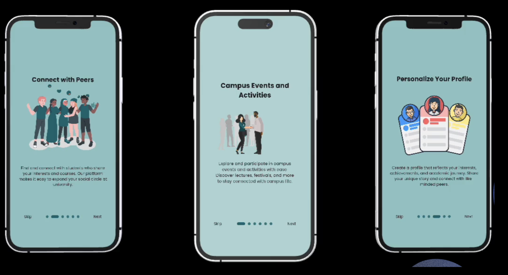
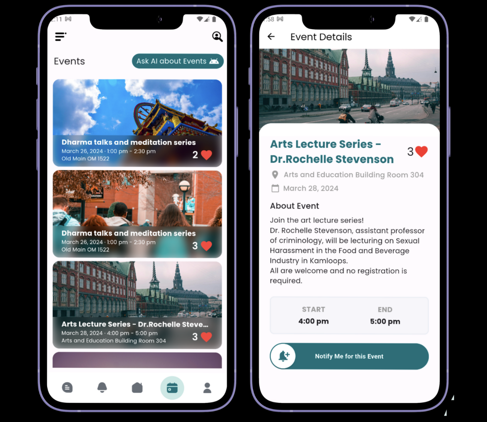
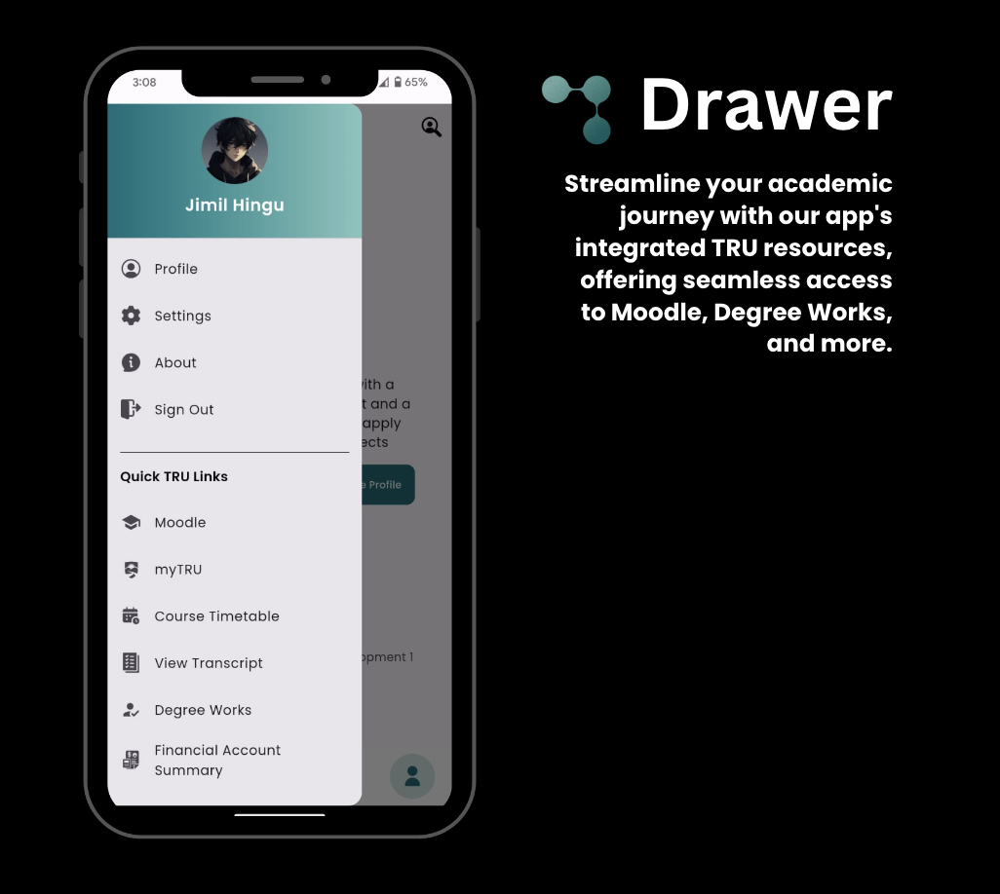
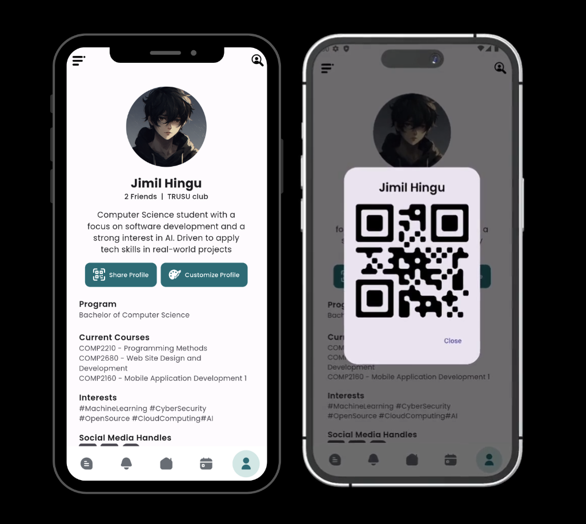
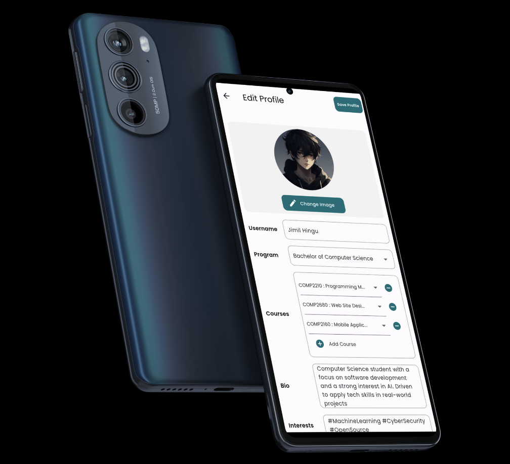
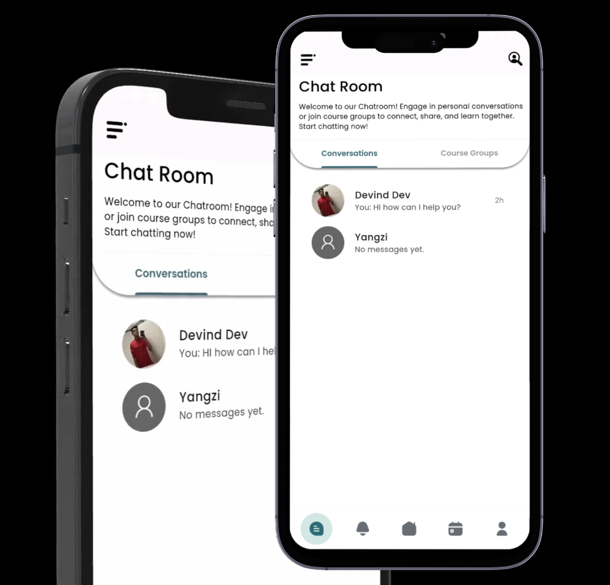
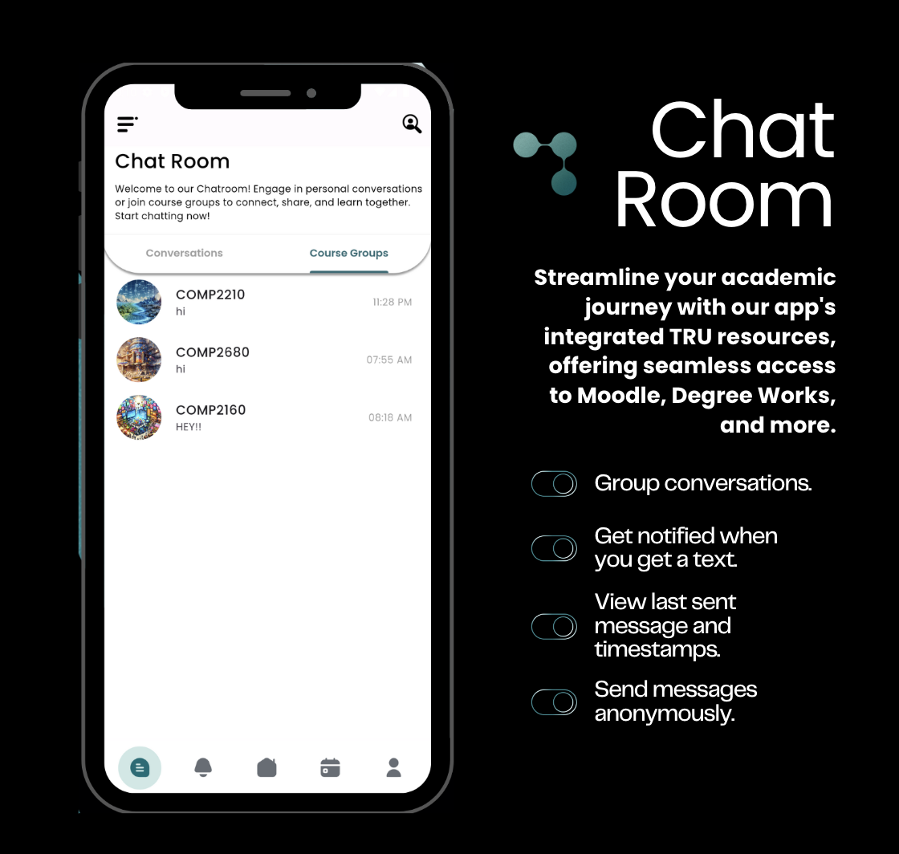

# Univolve: Enhancing Student Engagement at Thompson Rivers University

**Univolve** is a comprehensive event management and social interaction platform specifically designed for the students of Thompson Rivers University (TRU). This app centralizes scattered event information, facilitating better accessibility and engagement among students. With features like personalized event notifications, social media integration, and real-time interaction capabilities, Univolve aims to enrich the university experience by keeping students connected and informed about campus activities.

## Why Univolve?
- **Personalized Academic Dashboard:** Tailors information and updates specifically to your academic interests.
- **Events at a Glance:** Quickly view all upcoming university events, making it easier to stay informed and involved.
- **Chat Rooms:** Connect with friends and peers in dedicated chat rooms for courses and common interests.

## Key Features:

<table>
<tr>
<td></td>
<td><strong>Intuitive Onboarding Screens:</strong> Easy to navigate onboarding process to get you started quickly.</td>
</tr>
<tr>
<td></td>
<td><strong>Personalized Home Screen with AI Integration:</strong> Custom home screen that adapts to your academic and social preferences.</td>
</tr>
<tr>
<td></td>
<td><strong>Events Page:</strong> Utilizes web scraping to gather event information and AI integration for querying event details, featuring a sleek glassmorphism design.</td>
</tr>
<tr>
<td></td>
<td><strong>Drawer:</strong> Provides quick access to important TRU links and resources, all in one convenient location.</td>
</tr>
<tr>
<td></td>
<td><strong>Profile Page:</strong> Create a detailed profile with your photo, bio, and academic interests. Share a QR code to connect with peers and customize your profile with ease.</td>
</tr>
<tr>
<td></td>
<td><strong>Customizing Your Profile:</strong> Simple UI to select and manage courses via a dropdown menu.</td>
</tr>
<tr>
<td></td>
<td><strong>Chat Page:</strong> Engage in personal conversations, receive notifications for new messages, and see the last message along with timestamps.</td>
</tr>
<tr>
<td></td>
<td><strong>Course Group Integration:</strong> Join group conversations for your courses, send messages, and participate anonymously if desired.</td>
</tr>
</table>

## Firebase Integration:
- **Real-Time Data Synchronization:** Ensures all your data is continuously updated and synchronized across all devices.
- **Robust Security:** Protects personal and chat data with advanced security measures.
- **Seamless Registration & Login:** Utilizes Firebase Auth for easy and secure user authentication.

## Screens:
- **Login and Register Screens:** Smooth and secure login process.
- **Forget Password Integration:** Provides easy recovery options for users.

Univolve is developed with Flutter and Firebase, offering a robust and user-friendly interface that enhances student life through technology. Dive into our repository to see how we built Univolve, including detailed code documentation, setup instructions, and more.

